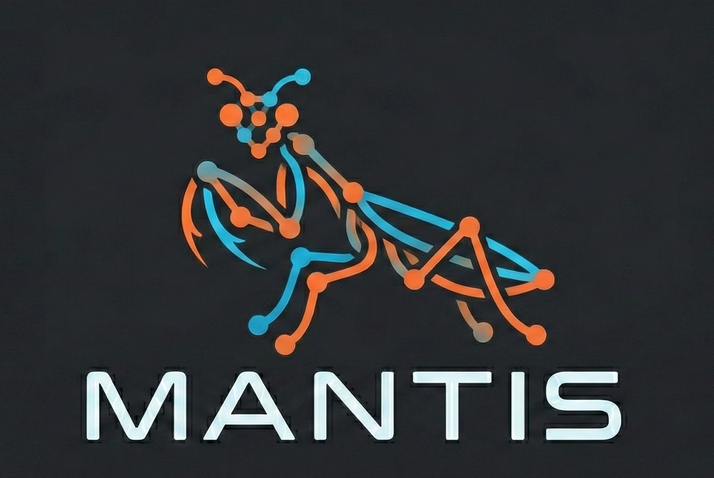

# Self-Hosted Agents

  

This project focuses on deploying and managing self-hosted AI agents using **OpenClaw**, **Telegram**, and **n8n**.

## Project Goal
The primary objective is to integrate OpenClaw with Telegram and n8n to create powerful, automated agent workflows.

## Validated Tech Stack
-   **OpenClaw**: Core agent framework/tool.
-   **n8n**: Workflow automation tool.
-   **Telegram**: Interface for interacting with agents.
-   **Infrastructure**:
    -   Terraform
    -   Helm
    -   Docker

## Directory Structure
-   `infra/`: Infrastructure configuration (Terraform, Helm, scripts).
-   `mantis/`: Agent definitions and workflows (JSON configurations).

## Getting Started
1.  **Prerequisites**:
    -   Docker
    -   (Optional) pre-commit hooks installed (`pre-commit install`)

2.  **Configuration**:
    Review the `.pre-commit-config.yaml` and `.gitignore` to understand coding standards and ignored files.

3.  **Deployment**:
    Navigate to `infra/` for deployment scripts and configurations.

## Development
-   Ensure pre-commit hooks are run before committing changes: `pre-commit run --all-files`.
